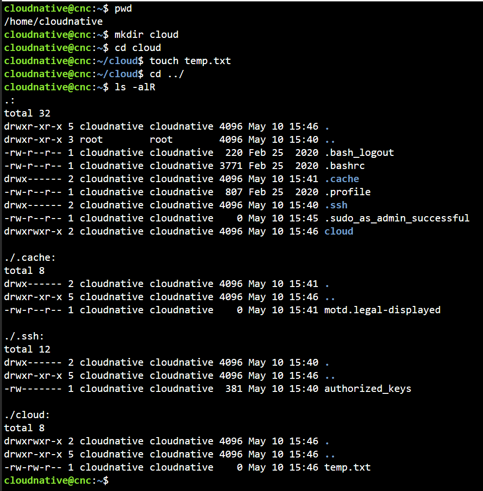
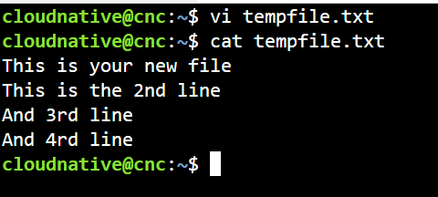
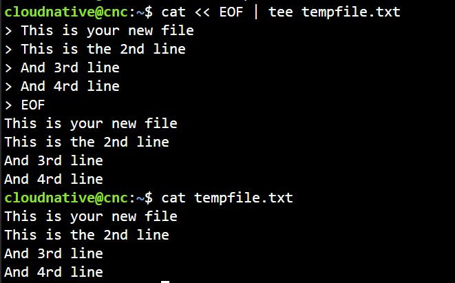

## Filesystem Management with Linux

1. Create and delete folder/file with Linux command
```bash
## Show current directory
pwd

## Create a folder named cloud
mkdir cloud

## Change you current directory to cloud
cd cloud

## Create a blank file
touch temp.txt

## Go back to the parent directory of your current directory
cd ../

## List all files and their properties of the current directory and 
ls -alR

## Delete file
rm cloud/temp.txt
ls cloud

```

Result:


2. Read and edit file content

```bash
### Use vim to create and edit file
vi tempfile.txt

### Press "a" or "i" to edit file, and enter your content
### Press "Esc" and ":wq" to save the file and exist the editor
### Show file content
cat tempfile.txt

### The other way is use "redirect", run the following commands, we use this for non-interactive session
cat << EOF > tempfile.txt
This is your new file
This is the 2nd line
And 3rd line
And 4rd line
EOF

### Or use "tee"
cat << EOF | tee tempfile.txt
This is your new file
This is the 2nd line
And 3rd line
And 4rd line
EOF
```

Using VIM


Using tee
